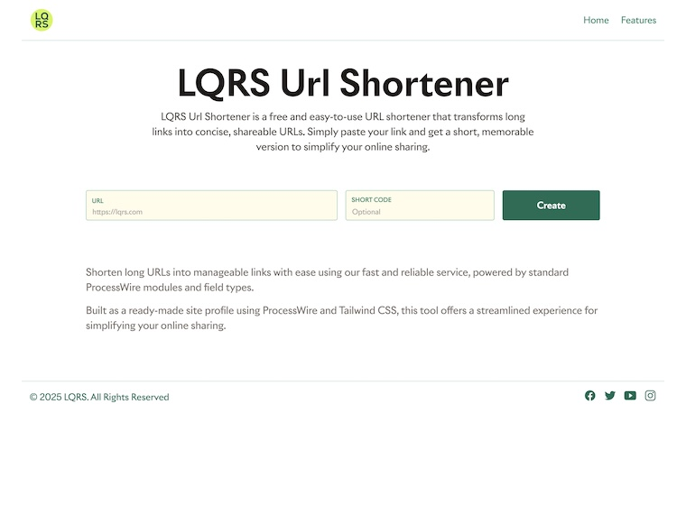

# LQRS URL Shortener

LQRS URL Shortener is a free and easy-to-use tool that transforms long links into concise, shareable URLs. Built with ProcessWire CMS and styled with Tailwind CSS, this service offers a streamlined experience for simplifying your online sharing.

## Features

- **Efficient Short Link Management**: The core of our system uses the ProcessWire Repeater module with the shortlinks field. This allows you to easily create and organize your short URLs.
- **Trackable Links**: Each entry in the shortlinks repeater manages its own URL, short link text, and click count. This allows you to track the performance of your shortened links.
- **ProcessWire Power**: The system is built upon the adaptable ProcessWire CMS, providing a robust and reliable foundation.
- **Tailwind CSS Styling**: Enjoy a modern and responsive interface thanks to the utility-first styling of Tailwind CSS.
- **Ready-Made Site Profile**: Get started quickly with our pre-configured site profile. It’s ready to use and easily customizable.
- **Customizable Repeater Labels**: Repeater labels can be fully customized, using bracketed field names or the inclusion of an index number, offering flexibility in how you display and manage your data.
- **Edit Field Configuration**: The shortlinks repeater setup can be explored and customized within the Edit Field configuration. You have access to sections such as: basics, details, input, access, advanced settings, actions, and overrides. This makes it easy to fine-tune the functionality to your exact needs.

## Installation

1. **Download and Install ProcessWire**: Ensure you have ProcessWire installed on your server. If not, download it from [ProcessWire's official website](https://processwire.com/).
2. **Import the Site Profile**: Import the LQRS URL Shortener site profile into your ProcessWire installation.
3. **Configure Your Environment**: Set up any necessary configurations in the Admin panel, including setting up templates and fields.
4. **Styling Customization**: Customize the appearance of your URL shortener by modifying the Tailwind CSS styles according to your preferences.

## Usage

### Creating a Short URL

1. Navigate to the URL shortener page.
2. Enter the original long URL in the designated form field.
3. Optionally, provide a custom short code or let the system generate one automatically.
4. Add additional metadata like title and description if desired.
5. Submit the form to create the short URL.

### Managing Short URLs

- View recently created short URLs in the admin dashboard.
- Monitor the click count for each short URL to track its performance.
- Edit or delete short URLs as needed through the admin interface.